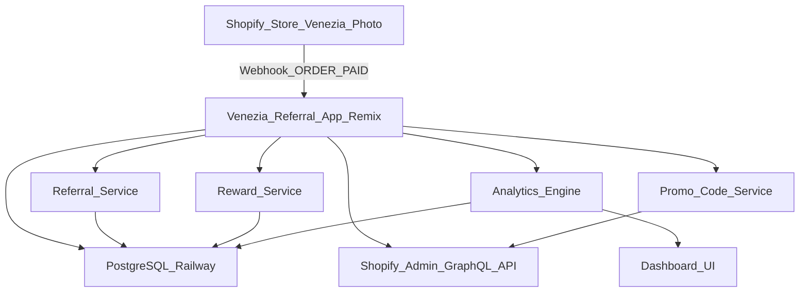

# 🎟️ Venezia Referral App

A **Remix-based Shopify app** built for **Venezia Photo**, designed to automate and manage a complete referral system for workshop purchases.  
It connects directly to the **Venezia Photo Shopify store**, providing the team with a dashboard, reward logic, analytics, and referral tracking.

---

## 🧭 Core Concept

The Venezia Referral App introduces a structured referral flow inside the Venezia Photo e-commerce ecosystem:

1. **Referral creation** → After a purchase, a customer automatically receives a **unique referral code**.  
2. **Referral usage** → A new customer can use this code to receive a **discount** (e.g. 10 % off).  
3. **Reward system** → The referrer earns a **cashback (e.g. €20)** for every new referred purchase.  
4. **Dashboard** → Venezia admins can view referrers, referrals, and transactions in real time.  
5. **Legacy customers** → Admins can manually create one-time promo codes.  
6. **Analytics** → The system tracks usage, ROI, and detects potential abuse.

---

## 🧩 Functional Flow

### 1️⃣ Purchase Event
- Customer buys a workshop on Shopify.  
- The Shopify webhook `ORDER_PAID` triggers the app.  
- If the customer is new → generate a **referral code** and store it.  
- If the order contains a valid referral code → create a reward for the referrer.

### 2️⃣ Referral Code Usage
- Each referral code can be used **once per new customer**, but **many times in total**.  
- Shopify applies the discount through the app (Admin GraphQL API).

### 3️⃣ Cashback Rewards
- Each valid referral → creates a **Reward record**.  
- Cashback amount is configurable (default : €20).  
- Rewards can be **marked as paid** manually or via automation.

### 4️⃣ Admin Dashboard
Admins can:
- See all referrers and rewards.  
- Generate promo codes for legacy users.  
- Adjust cashback / discount settings.  
- View analytics and mark payouts.

---

## 🧱 System Architecture Overview

# 🧠 Venezia Referral App — Technical Reference

---

## 🧠 Data Model (Prisma)

### **Referral**
| Field | Type | Description |
|-------|------|-------------|
| id | String (UUID) | Unique referral ID |
| referrerId | String | Shopify ID of referrer |
| refereeId | String | Shopify ID of referred user |
| code | String | Referral code used |
| rewardId | String (optional) | Link to reward transaction |
| createdAt | DateTime | Creation timestamp |

### **Reward**
| Field | Type | Description |
|-------|------|-------------|
| id | String | Reward transaction ID |
| referrerId | String | Linked customer |
| amount | Float | Cashback amount |
| status | Enum (`pending`, `paid`, `failed`) | Payout status |
| createdAt | DateTime | Creation timestamp |

### **Code**
| Field | Type | Description |
|-------|------|-------------|
| id | String | Internal ID |
| code | String | Referral code |
| shopifyDiscountId | String | Shopify discount ID |
| referrerId | String | Owner of this code |
| usageCount | Int | Times used |
| maxUsage | Int | Max allowed |
| active | Boolean | Active or not |
| createdAt | DateTime | Creation timestamp |

---

## ⚙️ Environment Setup (Railway)

| Variable | Description |
|-----------|-------------|
| `APP_URL` | Public Railway URL of the app |
| `SESSION_SECRET` | Random secret for Remix sessions |
| `SHOPIFY_API_KEY` | From Partner Dashboard |
| `SHOPIFY_API_SECRET` | From Partner Dashboard |
| `SHOPIFY_SCOPES` | Shopify access scopes |
| `SHOPIFY_STORE_DOMAIN` | e.g. venezia-photo.myshopify.com |
| `DATABASE_URL` | Auto-generated by Railway PostgreSQL |

---

## 🔄 Event Flow

| Event | Trigger | Action |
|--------|----------|--------|
| `ORDER_PAID` | Shopify webhook | Creates referral + reward |
| `CUSTOMER_CREATED` | Shopify event | Generates referral code |
| `REWARD_PENDING` | Internal | Awaits payout |
| `REWARD_PAID` | Admin action | Marks payout done |
| `CODE_CREATED` | Post-purchase | Generates new code for referrer |

---

## 🧩 Business Rules

- Referral code usable only by **new customers**.  
- Referrer can earn **unlimited rewards**.  
- Reward and discount values are **configurable**.  
- Cashback requires **admin validation** (manual mark or automation).  
- **Fraud detection** on duplicate emails or IPs.  
- **One referral = one reward transaction.**  
- Rewards stored and exportable for **accounting**.

---

## 🧠 Technical Decisions

| Layer | Choice | Reason |
|-------|--------|--------|
| **Framework** | Remix | Server + client rendering, API routes, SSR |
| **ORM** | Prisma | Strong typing, migrations |
| **Hosting** | Railway | Simplified infra + DB |
| **API** | Shopify Admin GraphQL | Modern, flexible |
| **Auth** | Shopify OAuth | Secure integration |
| **Styling** | Tailwind + Polaris | Consistent with Shopify UI |
| **Charts** | Recharts | Lightweight visualization |
| **Emails** | Resend | Simple transactional setup |
| **Monitoring** | Railway Logs | Built-in monitoring |

---

## 🧰 CI/CD Pipeline

| Branch | Env | Workflow |
|--------|------|-----------|
| `main` | Production | `.github/workflows/deploy-prod.yml` |
| `dev` | Staging | `.github/workflows/deploy-dev.yml` |

### **Token Setup**

1. Generate a **Railway Deploy Token**  
   → `Project → Settings → Generate Deploy Token`
2. Add it to GitHub Secrets:  
RAILWAY_TOKEN = your_token

3. Automatic deployments on push to `main` or `dev`.

---

## 🧮 Analytics Dashboard KPIs

| Metric | Description |
|---------|-------------|
| **Total Referrals** | Number of unique referral links used |
| **Conversion Rate** | Referred orders / total codes |
| **Cashback Paid** | Total amount paid to referrers |
| **Average Reward** | Mean cashback per referrer |
| **Active Referrers** | Customers with more than 1 referral |
| **Abuse Flags** | Duplicates or suspicious activity detected |

---

## 🗺️ Roadmap

| Phase | Feature | Description |
|-------|----------|-------------|
| 1️⃣ | MVP | Referral + cashback + dashboard |
| 2️⃣ | Analytics | KPIs and conversion tracking |
| 3️⃣ | Friends of Venezia | Loyalty membership system |
| 4️⃣ | Shopify Connect | Automatic reward payouts |

